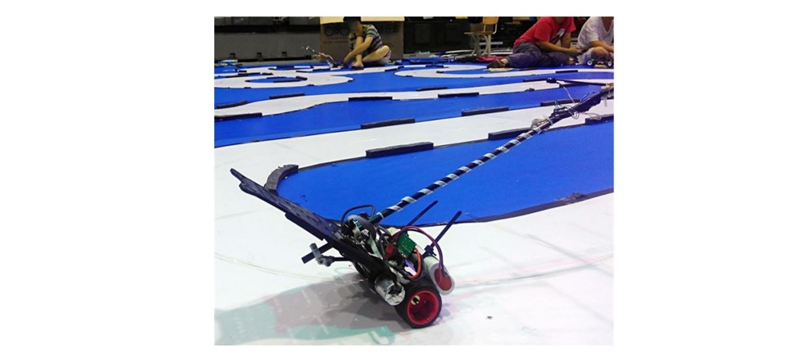

__Haixin Zhao is a research assistant at Reliable Flight Control Group at Beihang University.   His research interests lie in the areas of Aerial Robotics and Motion Control.   He received bachelor degree in 2020 from the School of Mechanical Engineering at Hebei University of Technology.   He worked as a control engineer on the gimbal for UAV before 2022.   Besides his research, he also follows many other areas, such as signal processing, sensors and actuators, and mechanical and circuit design.__

__He takes pleasure in analyzing this world through control theory.__

Research Projects
=======
## Connecting System Identification and High Performance Control System Design for Quadcopters

    

This work aims to model the angular velocity channels of the quadcopters via system identification. Based on the identification results, a new control scheme is proposed to improve the performance of a closed-loop system.

Most textbooks present the system model directly to design a control system with a SISO linear system, such as the state space model or transfer function. However, during the actual experiments, the system models are sometimes unavailable. 

This study bridges the actual system and computer-based control system designs. It provides a feasible scheme for acquiring the SISO linear system. According to the coherence function, it unlocks the technique for control system design with computers. Now, we can touch the real world and feel it. [__Read More__](/posts/2022/05/blog-post-1/)

## Fault Tolerant Control for UAVs

    

This project focuses on fault-tolerant control algorithms for UAVs with rotor failures, such as multicopter, bi-copter, helicopter, or other kinds of UAVs. Actuator failure is a severe fault, and it can easily result in an aircraft crash. 

This study aims to challenge the control problems of those UAVs with rotor failure. By abandoning the yaw channel with careful controller design, the fault-tolerant ability of some kinds of UAVs is achieved by falling into self-rotation around the yaw for those who suffer from the failures. 

Some new general problems have arisen by analyzing the principle of those vehicles’ fault-tolerant control phenomena. How to design a controller for a rigid body with some actuators in different placements, driven by the controller, the vehicle could be controlled by position command. However, it does not seem to be a familiar vehicle for people. Moreover, how to design a new vehicle endowed with better controllability？  [__Read More__](/posts/2023/10/blog-post-2/)

# Other Projects

## RflyPilot: A Compact and High Performance Flight Controller

    

RflyPilot is a small-sized, high-performance flight controller system with hardware and corresponding
software. It is designed to run complex flight control algorithms such as nonlinear Model Predictive Control.  For more details, please visit [__https://rflypilot.github.io__](https://rflypilot.github.io)__[in Chinese]__

## National University Students Smart Car Competition

    

He participated in the 12th and 13th National University Students Smart Car Competition. The objective of this competition was to design the hardware and software of the vehicle and complete the designated track at the fastest speed possible. He was responsible for writing the embedded software during the competition. Through the competition, he made many like-minded friends.

# Early Collection

## Air Hockey Robot

    

An air hockey robot with three stepper motors.

## Nano Balance Car

    

A nano two-wheel balance car with BLDC motor direct-drive scheme.

## Crystal Radio

    

This is a handcrafted DIY medium-wave radio that does not require an additional power supply input. It draws energy from radio waves and requires an approximately 10-meter-long antenna. It can receive two channels with clear reception.