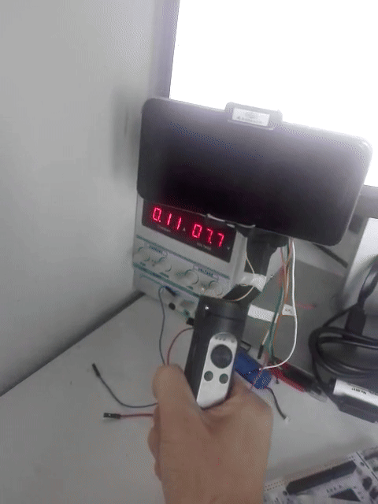
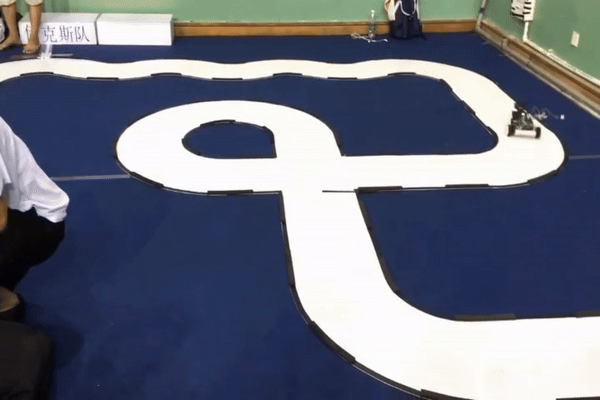

__Haixin Zhao is a research assistant in the Reliable Flight Control Group at Beihang University.   His research interests lie in the areas of Aerial Robotics and Motion Control.   He received bachelor degree in 2020 from the School of Mechanical Engineering at Hebei University of Technology.   He worked as a control engineer on the gimbal for UAV before 2022.   Besides his research, he also follows many other areas, such as signal processing, sensors and actuators, and mechanical and circuit design.__

__He takes pleasure in analyzing this world through control theory.__

News
=======
 - May 16, 2024. Haixin presented an oral titled "[Relaxed Hover Solution Based Control for a Bi-copter with Rotor and Servo Stuck Failure](/files/4006.pdf)" at the International Conference on Robotics and Automation (ICRA 2024) in Yokohama, Japan.

Research Projects
=======

## Precise Autolanding of a Unmanned Parafoil (2024)

## Reliable Flight Platform for Aerial Manipulator (2024)
Many aerial manipulations require close interaction with the environment. The environments these flight platforms encounter are more complex than those in traditional applications like aerial photography. Uncertainties in the environment may cause interference with the flight platform, potentially affecting mission completion. Therefore, the reliability of the flight platform is crucial for successful manipulation. This project introduces a novel configuration for a multicopter used as an aerial manipulation platform, aiming to enhance platform reliability and maintain precise position control, especially in the event of rotor failure or external disturbances. [__Read More__](/posts/2024/04/blog-post-4/)

    

## Fault Tolerant Control for UAVs (2023)

    

This project focuses on fault-tolerant control algorithms for UAVs with rotor failures, such as multicopter, bi-copter, helicopter, or other kinds of UAVs. Actuator failure is a severe fault, and it can easily result in an aircraft crash. 

This study aims to challenge the control problems of those UAVs with rotor failure. By abandoning the yaw channel with careful controller design, the fault-tolerant ability of some kinds of UAVs is achieved by falling into spinning around the yaw for those who suffer from the failures. 

Some new general problems have arisen by analyzing the principle of those vehicles’ fault-tolerant control phenomena. How to design a controller for a rigid body with some actuators in different placements, driven by the controller, the vehicle could be controlled by position command. However, it does not seem to be a familiar vehicle for people. Moreover, how to design a new vehicle endowed with better controllability？  [__Read More__](/posts/2023/10/blog-post-2/)

## Connecting System Identification and High Performance Control System Design for Quadcopters (2022)

    

This work aims to model the angular velocity channels of the quadcopters via system identification. Based on the identification results, a new control scheme is proposed to improve the performance of a closed-loop system.

Most textbooks present the system model directly to design a control system with a SISO linear system, such as the state space model or transfer function. However, during the actual experiments, the system models are sometimes unavailable. 

This study bridges the actual system and computer-based control system designs. It provides a feasible scheme for acquiring the SISO linear system. Now, we can touch the real world and feel it. [__Read More__](/posts/2022/05/blog-post-1/)

# Other Projects

## RflyPilot: A Compact and High Performance Flight Controller (2023)

    

RflyPilot is a small-sized, high-performance flight controller system with hardware and corresponding
software. It is designed to run complex flight control algorithms such as nonlinear Model Predictive Control. 
<!-- For more details, please visit [__https://rflypilot.github.io__](https://rflypilot.github.io)__[in Chinese]__ -->

## Air Hockey Robot (2021)

    

An air hockey robot with three stepper motors supported by [Shenzhen InnoX](https://innoxsz.com/).

## Nano Balance Car (2021)

    

A nano two-wheel balance car with a BLDC motor direct-drive scheme. This project focuses on providing a low-cost, ESP32-based, multi-sensor system for learning and designing control systems. It includes control algorithms, BLDC motor driver, state estimation, and calibration. Haixin conceived this project in 2019 and designed it in 2021.

## The Gimbal for Phones (2020)

    

This gimbal is used for phone stabilization. Haixin designs the control algorithm for this gimbal. It contains three BLDC motors and encoders, which are used for angular motion. An IMU is also attached to the phone to estimate its attitude. By focusing on this project, Haixin has gained knowledge of BLDC motors and their control, adding an important piece to his network of knowledge.

## National University Students Smart Car Competition (2017 & 2018)

    

He participated in the 12th and 13th National University Students Smart Car Competition. The objective of this competition was to design the hardware and software of the vehicle and complete the designated track at the fastest speed possible. He was responsible for writing the embedded software during the competition. Through the competition, he made many like-minded friends.

# Early Collections

## UMVIEW : A Time Machine from 2016 (2016)

    

[__UMVIEW.COM__](https://www.umview.com), established by Haixin, is a collaborative blog that feels like a time machine as you review it. Its predecessor was youthope.com(2015). Haixin is [nash.zhao](https://www.umview.com/author/1/) in the blog.

## Crystal Radio (2011)

    

This is a handcrafted DIY medium-wave radio that does not require an additional power supply input. It draws energy from radio waves and requires an approximately 10-meter-long antenna. It can receive two channels with clear reception.

## High Voltage Pulse Generator (Up to 800V DC, 2009)

    

A high voltage generator (pulse form) is designed by Haixin. It contains multiple capacitors and a step-up transformer, and generates pulsating signals through a mechanical relay. It can be used to ignite flammable materials or to make electric mosquito swatters.

__Unfortunately, some of Haixin's creations are not listed on this website, mainly due to a lack of camera equipment. Additionally, due to limited materials, the original creations have to be dismantled in order to make new ones. :-(__